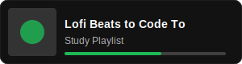
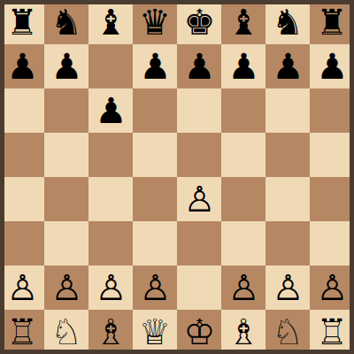

  
  
  

    Computer Science Student @ COER University
  

  
  

 

  

 

  

<h2 align="center">The Middle Game (Projects)</h2>

<table align="center" style="border: none;">
  <tr>
    <td align="center" width="33%">
      <h3>♟️ Sicilian Defense</h3>
      (Sharp & Aggressive)
        
      <strong>AI Context-Aware Chatbot</strong>
        
      <a href="#">View Code</a>
    </td>
    <td align="center" width="33%">
      <h3>♕ Queen's Gambit</h3>
      (Strategic & Solid)
        
      <strong>Alzheimer's Detection</strong>
        
      <a href="#">View Code</a>
    </td>
    <td align="center" width="33%">
      <h3>♗ Ruy Lopez</h3>
      (Positional Control)
        
      <strong>Behavior Prediction</strong>
        
      <a href="https://github.com/alokmavi/Behavior-Prediction-System">View Code</a>
    </td>
  </tr>
</table>

 

  <h3>1 - 0 (Resignation)</h3>
  
  
  &nbsp;
  

